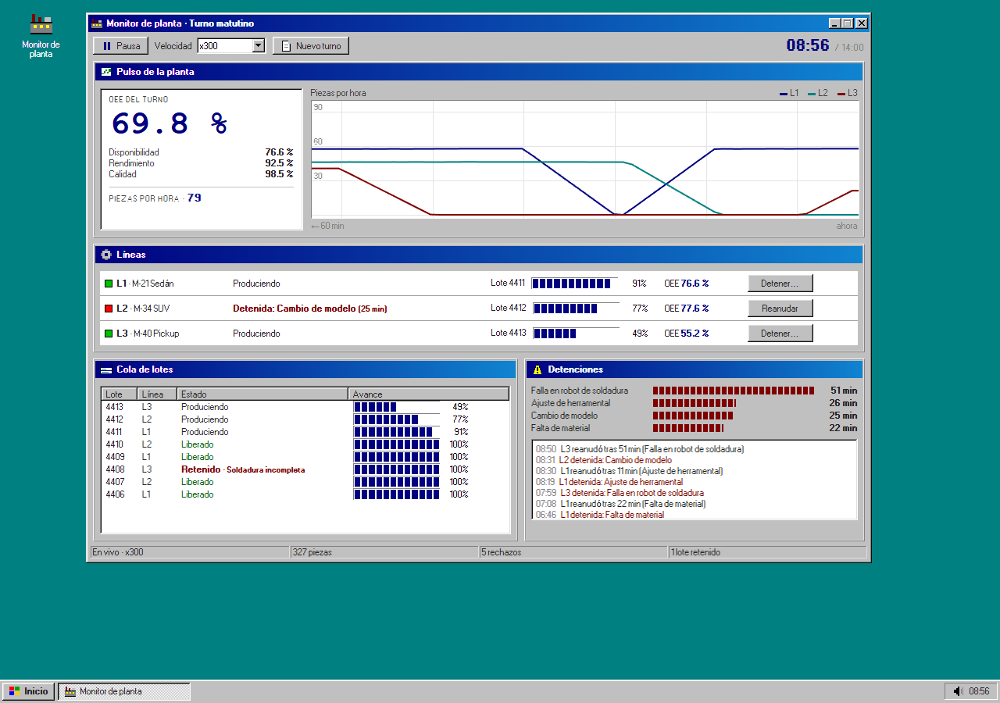
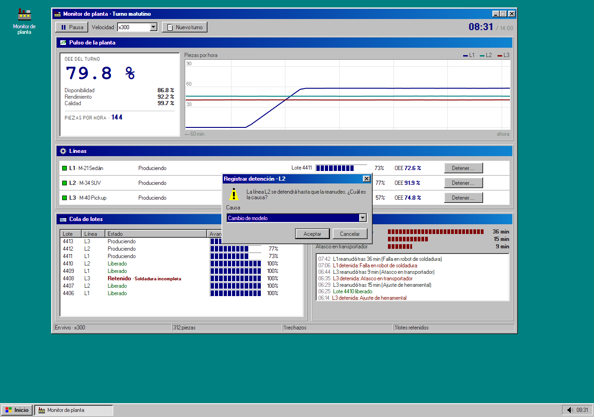

# Monitor de planta

*Tres líneas de producción en vivo, con cara de programa de Windows 98.*

La hermana en tiempo real de [Planta: consolidador y OEE](https://github.com/Brunich/Reportes-De-Produccion-OEE). Aquel lee los reportes cuando el turno ya terminó; este muestra el turno mientras pasa: el OEE que se mueve, las piezas por hora de cada línea, los lotes que salen, se inspeccionan y se liberan o retienen, y las detenciones con su causa.



**Abrirlo:** [monitor-de-planta.vercel.app](https://monitor-de-planta.vercel.app)

## Cómo funciona

1. **Corre el turno.** Tres líneas (sedán, SUV y pickup) producen a su ritmo, con rechazos y fallas al azar. Se puede ver en tiempo real, a x60 o a x300.
2. **Detén una línea.** Con «Detener…» eliges la causa y la línea se queda parada hasta que la reanudas; la disponibilidad y el Pareto cambian en ese momento.
3. **Sigue los lotes.** Cada lote de 150 piezas pasa a inspección al terminar; si rechaza más del 3 %, se retiene con su defecto principal.



## Qué hay adentro

| Archivo | Qué hace |
| --- | --- |
| `src/sim.ts` | La planta: producción, rechazos, detenciones, lotes y OEE. Con semilla, así cada prueba sale igual. |
| `src/LiveChart.tsx` | La gráfica de piezas por hora en canvas, dibujada cada cuadro para que corra de lado. |
| `src/App.tsx` | La ventana, los paneles, el diálogo de detención y la barra de tareas. |
| `src/icons.tsx` | Íconos de 16 px hechos con rectángulos. |

## Decisiones

- El OEE se calcula igual que en el consolidador: disponibilidad × rendimiento × calidad.
- La simulación avanza en pasos de un segundo, así la velocidad no cambia el resultado.
- Las piezas por hora son de los últimos 10 minutos: medidas minuto a minuto salían en serrucho.
- El estilo sale de [98.css](https://github.com/jdan/98.css) (MIT); los paneles, las barras por bloques y la barra de tareas son propios.

## Correrlo

```bash
npm install
npm run dev
```

```bash
npm test        # pruebas de la simulación (node:test)
npm run build   # tipos + build de producción
```

Hecho con React 19, TypeScript y Vite. Necesita Node 22 o más nuevo.

## In English

A live monitor for three production lines, styled like a Windows 98 program. It simulates a shift in real time (or x60/x300): OEE, parts per hour per line, batches going through inspection, and downtime with its cause. You can stop a line yourself and watch availability and the Pareto react.

## Licencia

[MIT](LICENSE). Úsalo, cámbialo y compártelo; sólo conserva el aviso de copyright.

---

Parte del [portafolio de Bruno Salas](https://bruno-portfolio-azure.vercel.app) · [GitHub](https://github.com/Brunich)
